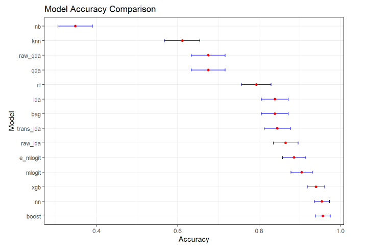

# Data Presentation

This study utilizes the [SUPPORT2 dataset](https://archive.ics.uci.edu/dataset/880/support2) from the UCI Machine Learning Repository to analyze and predict healthcare outcomes. This dataset comprises 9105 individual critically ill patients across 5 United States medical centers, accessioned throughout 1989-1991 and 1992-1994. The dataset consists of records from 9,105 critically ill patients admitted to five medical centers in the United States between 1989-1991 and 1992-1994. Each entry includes comprehensive information on patients who met the criteria for nine disease categories: acute respiratory failure, chronic obstructive pulmonary disease, congestive heart failure, liver disease, coma, colon cancer, lung cancer, multiple organ system failure with malignancy, and multiple organ system failure with sepsis. The dataset has 47 variables consisting of a variety of physiological, demographic, and disease severity predictors.

# Disease Classification Machine Learning

# Hospital Charges
Predicting total hospital charges of critically ill patients via disease and several other health predictors. 

The project will use the following machine learning **linear** regression models (using `scikit-learn`): 
- Multiple Linear Regression
  - Weighted least squares remedial
  - Log transformation
- Lasso Regression
  - Cross-validation for optimal alpha hyperparamter
- Ridge Regression
  - Cross-validation for optimal alpha hyperparamter
- Elastic Net Regression
- Principal Component Regression

The project will use the following **tree based** machine learning models (using `scikit-learn` and `xgboost`: 
- Regression Tree
  - with pruning
- Bagging
  - with variable importance
- Random Forest
  - with variable importance
- Bayesian Additive Regression Trees (BART)
  - with variable importance
- Boosting
  - including selecting the tuning paramter
- XGBoost

This project features some mathematical introductions to the models, hyperparameter tuning via cross validation, feature importance and more.

